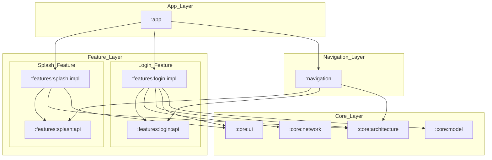
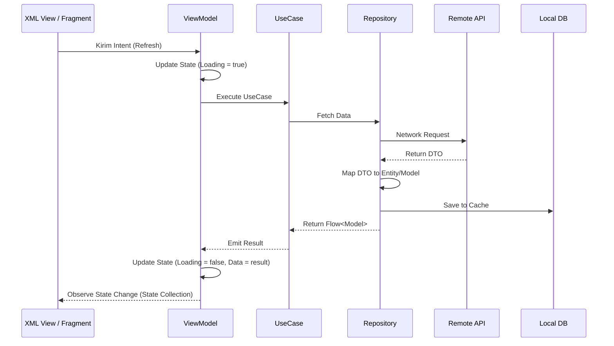

# Arsitektur Aplikasi (Clean Architecture)

Dokumen ini menjelaskan fondasi arsitektur yang digunakan dalam aplikasi ini untuk memastikan kode yang mudah diuji, dipelihara, dan dikembangkan oleh tim besar.

## 1. Filosofi Arsitektur
Kami mengadopsi **Clean Architecture** yang dipopulerkan oleh Robert C. Martin (Uncle Bob). Tujuan utamanya adalah pemisahan perhatian (*Separation of Concerns*) sehingga logika bisnis tidak tergantung pada framework UI, database, atau library pihak ketiga.

### Mengapa Clean Architecture?
- **Maintainability:** Mudah mengubah library (misalnya ganti Retrofit ke Ktor) tanpa merusak logika bisnis.
- **Testability:** Logika bisnis (Domain) dapat diuji secara mandiri dengan Unit Test tanpa emulator.
- **Independence:** UI bisa berubah total (XML ke Compose atau sebaliknya) tanpa menyentuh repository.

---

## 2. Layer Arsitektur

### A. Presentation Layer (UI)
Bertanggung jawab untuk menampilkan data ke layar dan menangkap interaksi pengguna.
- **Teknologi:** XML Layout, DataBinding, Fragment/Activity & ViewModel.
- **Pola:** MVI (Model-View-Intent).
- **Dependency:** Tergantung pada **Domain Layer**.

### B. Domain Layer (Bisnis)
Pusat dari aplikasi. Berisi logika bisnis murni.
- **Komponen:** UseCase, Entity, dan Repository Interface.
- **Aturan Emas:** Tidak boleh memiliki dependensi ke layer lain (Android framework-free).

### C. Data Layer (Infrastructure)
Implementasi dari pengambilan data.
- **Komponen:** Repository Implementation, Data Source (Remote & Local), Mapper, DTO.
- **Dependency:** Tergantung pada **Domain Layer** (melalui implementasi interface).

---

## 3. Dependency Direction & Modularization
Arah dependensi selalu **masuk ke dalam** (menuju Domain Layer) dan mengikuti pola **Feature-API/Impl**.

### Visualisasi Struktur Modul


Pola ini menggunakan **Dependency Inversion Principle (DIP)** dari SOLID. Modul `:impl` bergantung pada `:api` miliknya sendiri dan modul `:core`. Modul lain hanya bergantung pada `:api` untuk melakukan navigasi atau menggunakan model data publik.

---

## 4. Distributed Navigation (Navigasi Terdistribusi)
Modul `:app` tidak lagi mengimpor implementasi Screen secara langsung. Navigasi didaftarkan secara otomatis melalui interface `FeatureApi`:
1.  **Fitur API**: Mendefinisikan rute (Destinations) di modul `:api`.
2.  **Fitur Impl**: Mengimplementasikan `FeatureApi` dan mendaftarkan rutenya di `registerGraph`.
3.  **Hilt Multibinding**: Modul `:app` mengumpulkan semua implementasi `FeatureApi` secara otomatis untuk membangun `AppNavHost`.

Pola ini memutus ketergantungan langsung antara `:app` dan layar spesifik, sehingga mempercepat kompilasi modul `:app`.

---

## 5. Contoh Implementasi

### Repository Interface (Domain)
```kotlin
interface LoginRepository {
    suspend fun login(credentials: LoginCredentials): Flow<ResultState<AuthToken>>
}
```

### UseCase (Domain)
```kotlin
class LoginUseCase @Inject constructor(
    private val repository: LoginRepository
) {
    operator fun invoke(credentials: LoginCredentials) = repository.login(credentials)
}
```

---

## 5. End-to-End Data Flow

Aliran data dalam aplikasi mengikuti pola reaktif menggunakan Kotlin Flow.



---

## 6. Anti-Pattern yang Harus Dihindari
- **God ViewModel:** Menaruh logika bisnis atau parsing JSON di dalam ViewModel.
- **Context Leak:** Mengirim `Context` ke Repository atau UseCase.
- **Circular Dependency:** Module A butuh B, Module B butuh A.
- **Direct DB Access:** Fragment langsung memanggil DAO.

---

## 7. Kesimpulan
Dengan mematuhi struktur ini, aplikasi kita akan memiliki batas arsitektur (*boundary*) yang jelas, mengurangi risiko regresi, dan siap untuk diskalakan seiring bertambahnya fitur dan pengembang.
