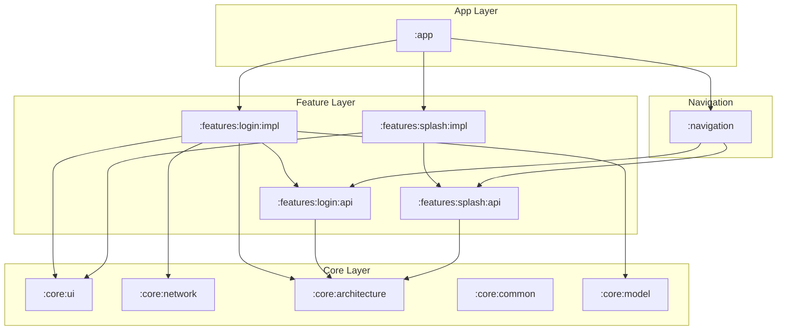

# Panduan Dependency & Library Project

Dokumen ini menjelaskan seluruh ekosistem library, plugin Gradle, dan dependensi arsitektur yang digunakan dalam project ini.

## 1. Tabel Ringkasan Library Utama

| Library | Purpose | Why Chosen | When To Use | When NOT To Use | Alternative | Scalability Impact |
| :--- | :--- | :--- | :--- | :--- | :--- | :--- |
| **Hilt** | Dependency Injection | Standard Google, boilerplate rendah. | Seluruh lifecycle aplikasi. | Project sangat kecil/scripting. | Koin, Dagger | Tinggi (Modularisasi mudah) |
| **DataBinding** | UI Library | Deklaratif, sinkronisasi state ke UI otomatis. | Semua layer presentasi (XML). | Layout sangat sederhana (ViewBinding cukup). | ViewBinding, Compose | Medium (Kompilasi sedikit lebih lama) |
| **Hilt Nav** | Navigation DI | Injeksi ViewModel di Fragment. | Injeksi VM di Fragment. | Tanpa navigasi fragment. | Manual Injection | Medium |

---

## 2. Dependency Management Strategy

### A. Version Catalog (`libs.versions.toml`)
Kami menggunakan **Gradle Version Catalog** sebagai *single source of truth* untuk versi library.
- **Konsep:** Mendefinisikan versi dan library di satu file pusat.
- **Tujuan:** Menghindari konflik versi antar modul.
- **Masalah yang diselesaikan:** "Dependency Hell" di mana modul A pakai versi 1.0 dan modul B pakai versi 2.0.

### B. Convention Plugins (`build-logic`)
Konfigurasi Gradle yang berulang dipindah ke plugin kustom.
- **Placement:** Semua modul `:features` menggunakan `myapp.android.feature`.
- **Relationship:** Memastikan semua modul memiliki konfigurasi ProGuard, SDK version, dan testing yang identik.

---

## 3. Deep Dive Library Arsitektur

### Hilt (Dagger Hilt)
- **Cara Kerja:** Melakukan code generation saat compile time untuk menyediakan objek.
- **Integration Flow:** `@HiltAndroidApp` -> `@AndroidEntryPoint` -> `@Inject`.
- **Performance:** Sedikit menambah waktu compile, namun nol impact pada runtime performance (tidak pakai refleksi).
- **Tradeoff:** Belajar konsep Dagger bisa sulit bagi pemula.

### Kotlin Coroutines & Flow
- **Kenapa dipilih:** Arsitektur MVI membutuhkan aliran data asinkron yang bisa dibatalkan (cancelable).
- **Misuse:** Menjalankan coroutine di `GlobalScope` (menyebabkan memory leak). Gunakan `viewModelScope` atau `lifecycleScope`.

### Testing Libraries (JUnit, MockK, Turbine)
- **JUnit 5:** Runner untuk unit test.
- **MockK:** Library mocking yang didesain khusus untuk Kotlin (mendukung `suspend` function).
- **Turbine:** Library kecil untuk mengetes Kotlin Flow tanpa perlu manual collection.

---

## 4. Diagram Hubungan Modul (Dependency Graph)

Aplikasi ini menggunakan **Directed Acyclic Graph (DAG)** untuk memastikan tidak ada ketergantungan sirkular.

---

## 5. Aturan Emas Dependency
1. **Piramida Terbalik:** Modul di lapisan atas (`:app`, `:features:impl`) boleh tahu tentang modul di bawahnya (`:core`, `:api`), tapi modul di bawah tidak boleh tahu tentang modul di atas.
2. **API vs Impl:** Modul luar hanya boleh bergantung pada `:api`. Hanya modul `:app` yang boleh bergantung pada `:impl` untuk keperluan Dependency Injection.
3. **No Circularity:** Modul A tidak boleh bergantung pada modul B jika B sudah bergantung pada A.

---

## 6. Kesimpulan
Pemilihan library didasarkan pada **Android Modern Development (MAD)** yang didukung penuh oleh Google dan komunitas. Dengan menjaga grafik dependensi tetap bersih, kita memastikan waktu kompilasi yang optimal dan mempermudah pengujian modul secara isolasi.
